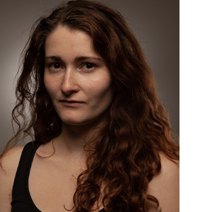

<!-- This is a comment, only visible to the author: Add a link to your presentation. -->
<!-- Presentations do not need to be a PDF, you may link elsewhere, such as Figma, YouTube, etc. -->
<!-- Consider adding navigation to each section (About, Featured Projects, Notes, etc.) -->

- [Home](#home)
- [About me](#more_about_me)
- [My work](#work)

## About

<!-- Consider including a headshot. We’re not designing, so keep the image width/height around 320px x 320px (square). Replace "surname" with your surname in the file name. -->

**Hi there! I’m Martina. A graphic designer and illustrator. I live in Prague.**

My educational journey started at the Business Academy. After that, I pursued my education in Graphic Design at the Higher Professional School of Visual Communication - Scholastica. This path eventually led me to the College of Creative Communication, where I further expanded skills and knowledge. My work has changed a lot throughout my journey. Every school has influenced me in some way. Just like the others. That's why we are each unique. We all have a different path. I believe that unique experiences shape us. Everyone has their own journey. 

Currently, I mainly focus on print design (DTP) and visual identities. Each project is slightly different. It all depends on the specific requirements. Recently, I have been diving deeper into typography, typesetting, and book design. I think, that design should be simple and clear. The right color can add finesse to visual part of design. 

Interestingly, prior to starting at VŠKK, I believed I was more inclined towards web design. However, I realized that my best outputs were in print materials. And it’s also what I enjoy the most. It may be due to my love for books. I love book and book design too. I adore books. I even had the opportunity to work at a bookstore for half of year. I found there my passion for book design. You could say it drew me in.

(Despite studying of Graphic Design) I find myself drawn towards hands-on work such as: drawing, painting, paper-cut illustration, lithography etc. For this reason, I want to obtaining a teaching qualification. I would like to teach art lessons at a Primary Art School.
