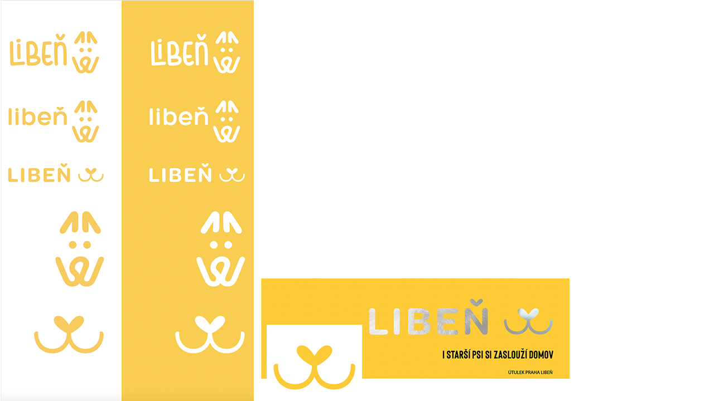
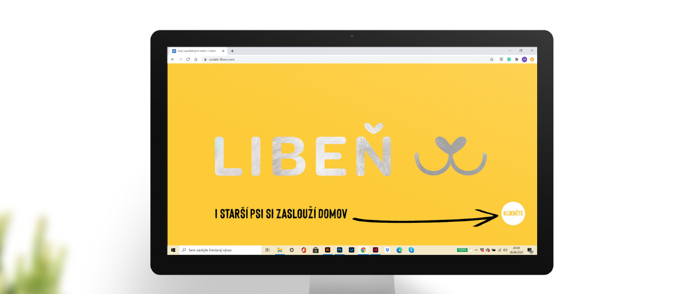
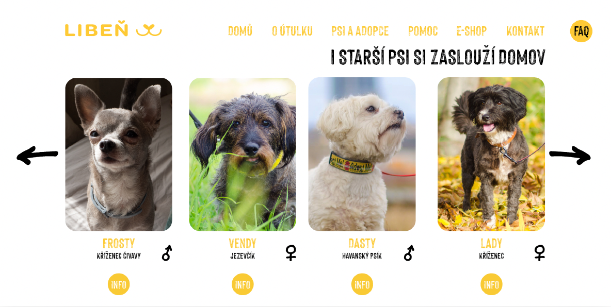
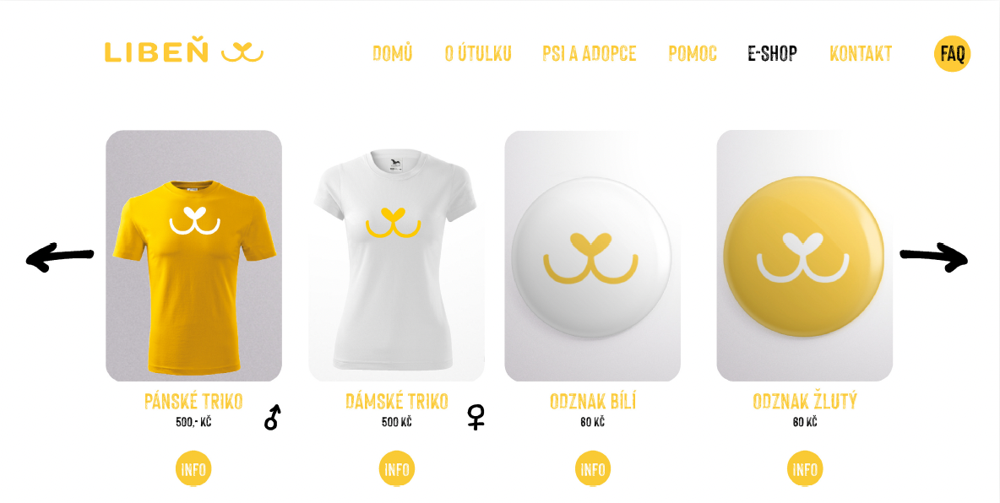
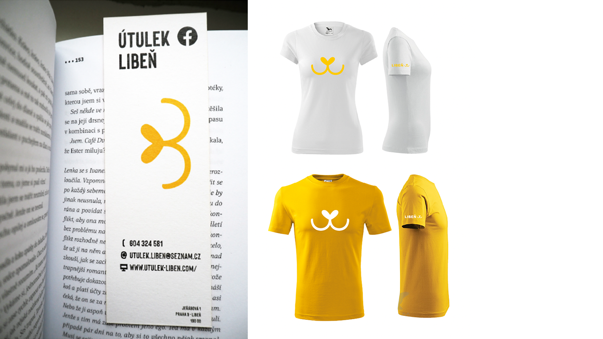
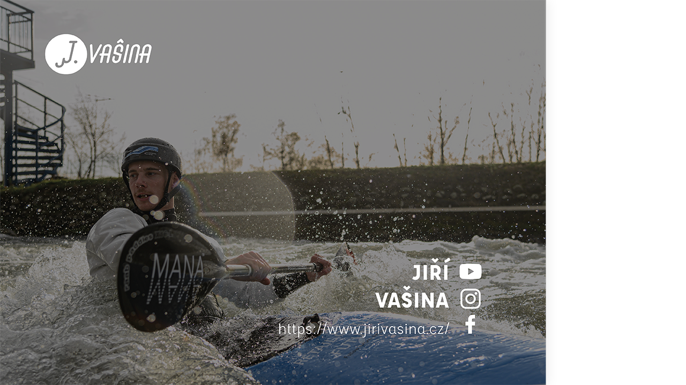
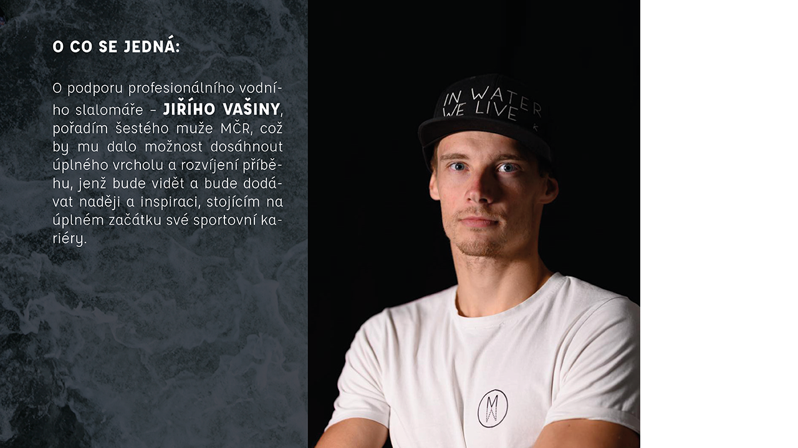

<!-- This is a comment, only visible to the author: Add a link to your presentation. -->
<!-- Presentations do not need to be a PDF, you may link elsewhere, such as Figma, YouTube, etc. -->
<!-- Consider adding navigation to each section (About, Featured Projects, Notes, etc.) -->

- [Home](#home)
- [About me](#more_about_me)
- [My work](#work)

# My work
## My Featured Projects

I chose these projects because they best describe what I want to be as a graphic designer.

### Featured Project 1 Visual identity - dog shelter Libeň

<!-- Use a static poster image or animated GIF, but no video files. Again, keep the image width/height manageable, around 1280x x 720px (16:9 aspect ratio), or a max-width of 1280px. -->

- I created this project as my final assignment at the Higher Professional School of Visual Communication - **Scholastica**. It involved creating a visual identity, which included designing a logo along with a logo manual, design of merchandise products, SoMe and a website. Thanks to this project, I earned the title **“Dis.”**

- I chose this project probably because I have a dog from a shelter.

- In the final version of the logo, I took inspiration a dog’s nose.Those who have a dog may have noticed that a content dog has dog lips more of volume. Finally, I created the main part of the snout into a heart shape. I chose yellow-orange as the main color - for its positive energy and symbolism. The secondary colors were white and, if anybody need use text - black (for text). Unfortunately, the project was not realized as the shelter did not communicate with me.

<!-- Use the same stucture above for the rest of your featured projects. -->

### Featured Project 2 Visual identity - CZECH SCHOOL without borders, London

<!-- Use a static poster image or animated GIF, but no video files. Again, keep the image width/height manageable, around 1280x x 720px (16:9 aspect ratio), or a max-width of 1280px. -->

- This assignment was given to us as part of the main subject (of graphic design specialization) at **the College of Creative Communication**. It was a real project. The connection was by **the Creative Office** of the college. It was group's work. Originally it should be just lifting of logo with change of visual identity, but more groups did redesign.

- I worked on this project together with Honza Honys. We started with lifting of logo, building upon the original logo and making improvements. We then changed the color scheme, focusing on more appealing shades. We defined two types of fonts. The playful font type was used only for the main headings (with alternating colors for each glyph in the heading). The second font was used for regular text and subheadings (which were in purple). We worked with photo (portrait)cropping and puzzle effects in the defined colors. The most dominant colors were white and ochre (yellow). For website links, we used a blue QR code. Regarding business cards, we had two types: one for the school and another for specific individuals. Additionally, we also worked on designs for SoMe (social media) and textbook covers.

### Featured Project 3 LOGO AND WEBSITE DESIGN

<!-- Use a static poster image or animated GIF, but no video files. Again, keep the image width/height manageable, around 1280x x 720px (16:9 aspect ratio), or a max-width of 1280px. -->

- I did this project at internship - at **DURT DESIGN**. It was about creating logo for czech slalomer **Jiří Vašina**.

- I created symbol from **"J"** as paddle with wave. The most important part - **the last name** - I placed behind the symbol. I did this because in the case of sports people is more important the last name than the full name.

- This collaboration also led to the design of the website, which was finalized by a web designer. Later on, I also created a presentation for **Jiří Vašina** (and for **Tereza Neumannová** - professional cyclist) to showcase to their sponsors.

### Featured Project 4 FLYERS AND OTHER PRINTED DESIGN

<!-- Use a static poster image or animated GIF, but no video files. Again, keep the image width/height manageable, around 1280x x 720px (16:9 aspect ratio), or a max-width of 1280px. -->

- I did this projects at internship - at **Systers bio**. This internship was about doing the printing part of their design. One of my co-worker do SoMe design (I am glad for this becouse I dislike creating SoMe and web banners.

- I created symbol from "J" as paddle with wave. The most important part - *the last name* - I placed behind the symbol. I did this because in the case of sports people is more important the last name than the full name.

- The main part of this brand is combination blue and beige (sometimes pink), using square brackets, archway, bigger dot (between title and text) and splash or pouring art at backgrounds.

### Featured Project 5 BOOK DESIGN

<!-- Use a static poster image or animated GIF, but no video files. Again, keep the image width/height manageable, around 1280x x 720px (16:9 aspect ratio), or a max-width of 1280px. -->

- This assignment was given to us as part of subject - **TYPOGRAPHY** - at **the College of Creative Communication**. It was a school project. It was one of more projects. It was not group's projects. We should to work with typesetting and creat a system for edition (included cover design).
  
- I use three colors - dark blue, light blue and pink. I also use the semicolon as dominant element (to cover of book and title page). I work with different system of numbering of pages (in pink color). The footnotes of the book was more dominanted than is normal (in blue color). And I was working with so many things, that it would be for a long time.

- I created two cover design of books in the edition. The thing that is changing is one of the three colors + and the same color is changed in footnotes.

- The main part of this brand is combination blue and beige (sometimes pink), using square brackets, archway, bigger dot (between title and text) and splash or pouring art at backgrounds.

<!Notes-->
